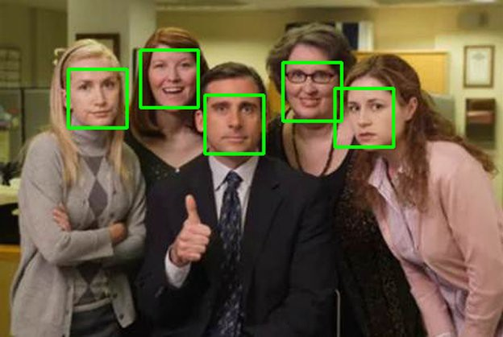

# Python Face Detection with OpenCV 🤓🐍

### How to run
- clone the project: `git clone url`
- install python OpenCV library: `pip install opencv-python`
- run `from_real_time_video.py` file
- to exit from the program, press the key `esc`  

### References
- [OpenCV frontal face default xml](https://github.com/opencv/opencv/blob/master/data/haarcascades/haarcascade_frontalface_default.xml) 
- [OpenCV Documentation](https://docs.opencv.org/4.x/)
- [Medium Article](https://towardsdatascience.com/face-detection-in-2-minutes-using-opencv-python-90f89d7c0f81)
- [Youtube Video](https://www.youtube.com/watch?v=R7B8sSByZGQ)

### Screen shots

